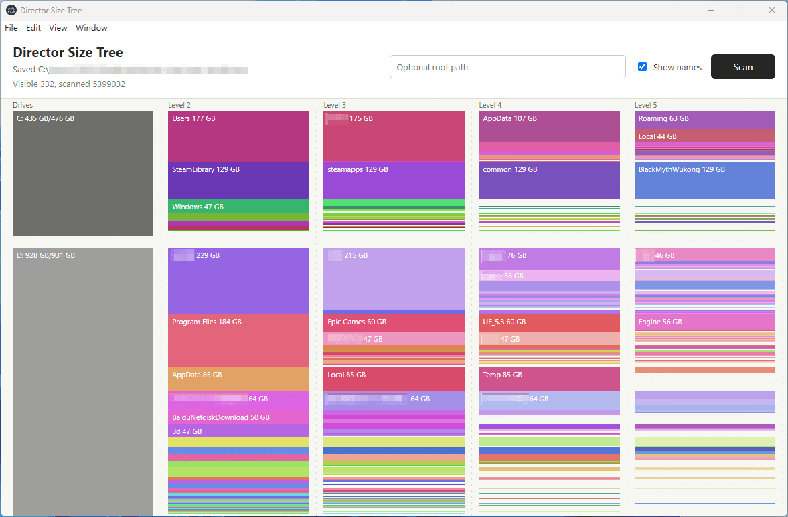

# Director Size Tree



A small desktop tool for seeing where disk and folder space is being used.

It draws drives, folders, and large files as size-scaled blocks. Taller blocks use more space, making it easier to spot the main sources of disk usage.

[中文说明](./README_zh.md)

## Features

- Scan all drives on the computer.
- Scan a specific folder by entering its path.
- Show results progressively while scanning.
- Highlight a block and its parent path on hover.
- Double-click a folder block to open it in the system file manager.
- Save scan results as JSON and load them later.
- Toggle whether names are shown on blocks.

## Usage

Install dependencies:

```bash
npm install
```

Start the app:

```bash
npm start
```

Build the Windows app:

```bash
npm run dist
```

The packaged files are written to `dist/`.

After the app opens:

1. Click `Scan` with an empty path field to scan the whole computer.
2. Enter a folder path and click `Scan` to scan only that folder.
3. Use `File -> Save Results...` to save the current result.
4. Use `File -> Load Results...` to load a saved result.

## Notes

Scanning large folders can take time. This is expected: operating systems usually do not keep a ready-made total size for every folder, so the app needs to walk through files and subfolders.

Very small files and folders may be omitted from the chart to keep the view readable.
